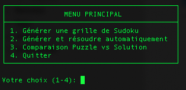
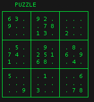

# 🎮 Sudoku Generator & Solver

Application console interactive de génération et résolution de grilles Sudoku, développée en **Test-Driven Development (TDD)**.

## 🚀 Démarrage Rapide

```bash
# Cloner le projet
git clone https://github.com/votre-utilisateur/Sudoku.git

# Aller dans le répertoire
cd Path/To/Sudoku

# Installer dotnet 9.0 si nécessaire
# https://dotnet.microsoft.com/en-us/download/dotnet/9.0

# Lancer l'application
dotnet run --project Sudoku

# Lancer les tests
dotnet test
```

## ✨ Fonctionnalités

### Menu Interactif

- 🎲 **Générer un puzzle** : Créez une grille Sudoku avec solution unique
- 🧩 **Générer et résoudre** : Créez un puzzle puis résolvez-le automatiquement
- 🔄 **Comparaison** : Affichez le puzzle et sa solution côte à côte
- 🎯 **Difficulté personnalisable** : Choisissez le nombre de cellules vides (20-60+)



### Affichage Console Élégant



## 🏗️ Architecture

```plaintext
Sudoku/
├── Display/         → Affichage console des grilles
│   └── GridDisplay.cs
├── Models/          → Structures de données
│   ├── Cell.cs
│   └── Grid.cs
├── Solver/          → Algorithme de résolution (backtracking)
│   └── Solver.cs
├── Generator/       → Génération de grilles
│   └── Generator.cs
└── Program.cs       → Application console avec menu

Sudoku.Tests/
├── CellTests.cs
├── GridTests.cs
├── SolverTests.cs
├── GeneratorTests.cs
├── Helpers/
└── TestData/
```

## 🎓 Développement TDD

Ce projet a été développé en suivant la méthodologie **Test-Driven Development** :

1. **Red** 🔴 : Écriture des tests avant le code
2. **Green** 🟢 : Implémentation minimale pour passer les tests
3. **Refactor** 🔵 : Amélioration et optimisation du code

### Exemples de TDD appliqués

- Tests de validation (IsValid, IsComplete, IsSolved) écrits avant l'implémentation
- Tests d'exceptions avant la gestion des erreurs
- Tests de génération avec solution unique avant l'algorithme
- Tests d'affichage avant la création de GridDisplay

## 🔧 Technologies

- **C# / .NET 9.0**
- **xUnit** pour les tests unitaires
- **Backtracking** pour la résolution
- **Algorithmes récursifs** pour la génération

## 🧪 Tests

Suite de tests complète avec **65 tests unitaires** couvrant :

- Manipulation des cellules et grilles
- Validation des règles du Sudoku
- Résolution de puzzles
- Génération de grilles

```bash
# Lancer tous les tests
dotnet test
```

## 📊 Projet

Ce projet a été réalisé dans le cadre d'un **POK** pour mettre en pratique le **Test-Driven Development**.

- **Durée** : ~20 heures
- **MVP Initial** : Modélisation + Solver
- **Objectif Final** : Générateur avec solution unique
- **Bonus** : Interface console interactive

### 👩‍💻 Auteur

Ludivine Mauget - 3ème année à Centrale Méditerranée - Option Do_IT
